# LeaveSync - Leave Management System

A modern, full-stack Leave Management System built with React, Node.js, Express, Prisma, PostgreSQL (Neon), and deployed on Vercel & Render.

---

## Live Demo

### Frontend
https://leave-management-system-rho-three.vercel.app

### Backend API
https://leave-management-system-xdn0.onrender.com

---

## Features

### Authentication

- JWT Authentication
- Role Based Access Control
- Protected Routes
- Secure Password Hashing (bcrypt)

---

### Employee

- Login
- Dashboard
- Apply Leave
- Cancel Pending Leave Requests
- View Notifications
- Leave History
- Leave Balance
- CSV Export

---

### Manager

- Dashboard
- Review Team Requests
- Approve Leave
- Reject Leave
- Add Comments
- Receive Notifications on Team Requests
- Export CSV

---

### Admin

- Dashboard
- User Management
- Leave Type Management
- Global Leave Requests
- Reports & Analytics
- Leave Calendar
- CSV Export

---

## Tech Stack

### Frontend

- React
- TypeScript
- Tailwind CSS
- React Router
- Axios
- React Hook Form

### Backend

- Node.js
- Express.js
- Prisma ORM
- PostgreSQL
- JWT
- bcrypt
- Multer

### Database

- PostgreSQL
- Neon

### Deployment

- Vercel
- Render

---

## Architecture

Frontend (React)

↓

Express REST API

↓

Prisma ORM

↓

PostgreSQL (Neon)

---

# Project Structure

```
leave-management-system

frontend/

backend/

prisma/

README.md
```

---

# Installation

## Clone

```bash
git clone https://github.com/Phaneendra2005/leave-management-system.git
```

```
cd leave-management-system
```

---

## Backend

```
cd backend

npm install

cp .env.example .env
```

```
DATABASE_URL=

JWT_SECRET=

PORT=5000
```

```
npx prisma generate

npx prisma db push

# Run backend unit tests
npm test

npm run dev
```

---

## Frontend

```
cd frontend

npm install

# Run frontend unit tests
npm test

npm run dev
```

---

# Demo Accounts

## Admin

Email

```
admin@company.com
```

Password

```
admin123
```

---

## Manager

Email

```
manager@company.com
```

Password

```
manager123
```

---

## Employee

Email

```
employee@company.com
```

Password

```
employee123
```

---

# Screenshots

## Login

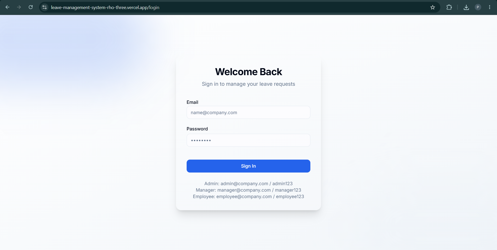

---

## Employee Dashboard

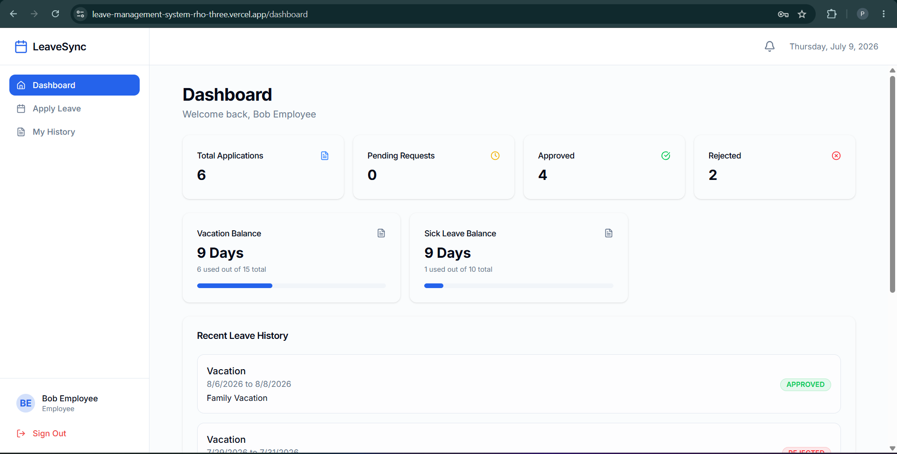

---

## Apply Leave

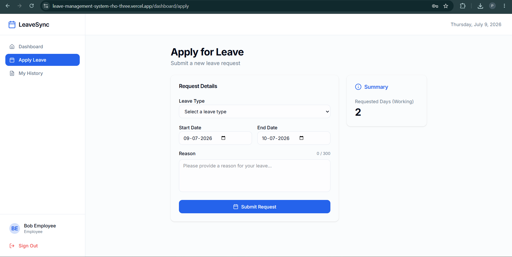

---

## Leave History

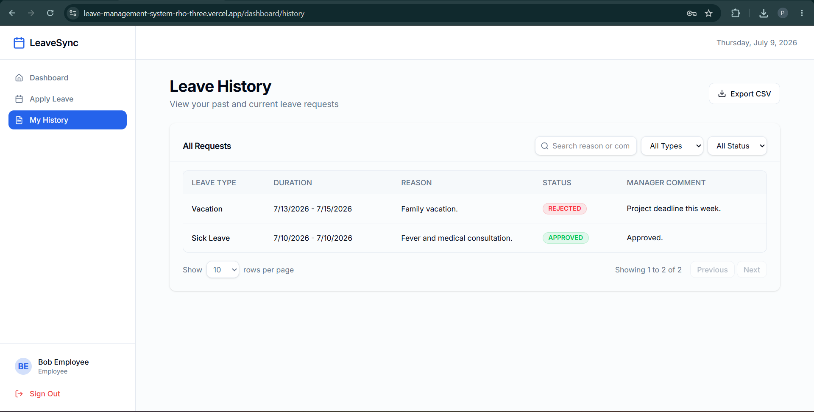

---

## Manager Dashboard

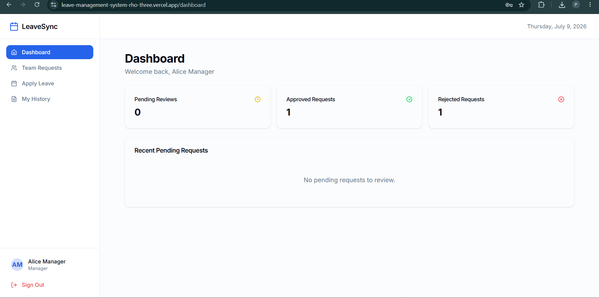

---

## Team Leave Requests

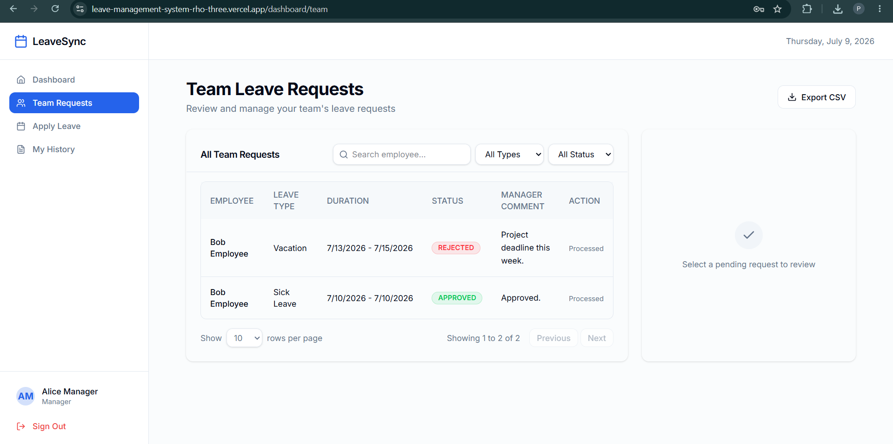

---

## Admin Dashboard

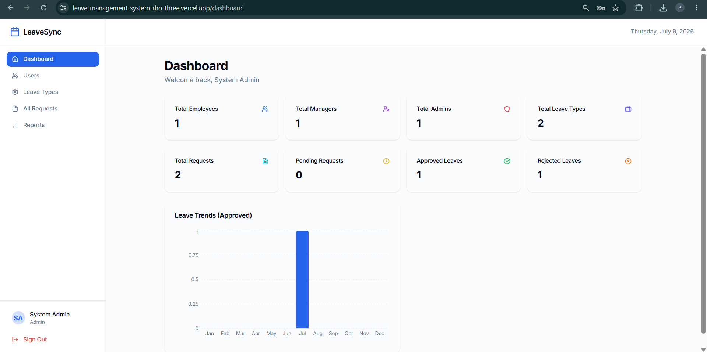

---

## User Management

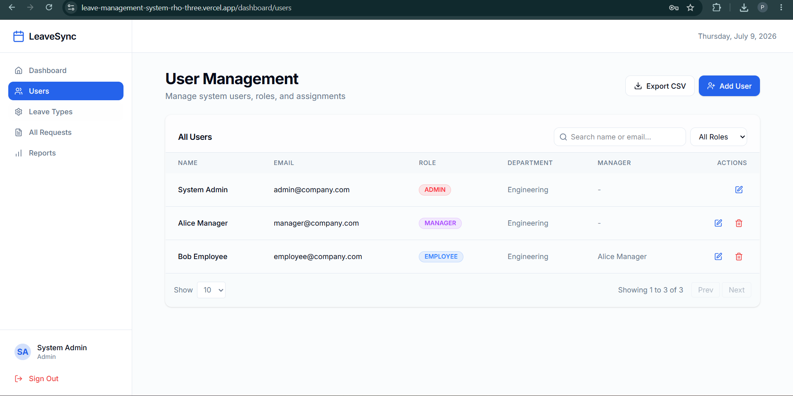

---

## Leave Types

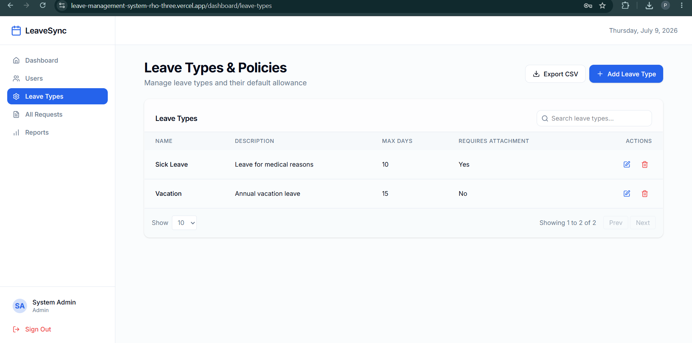

---

## All Leave Requests

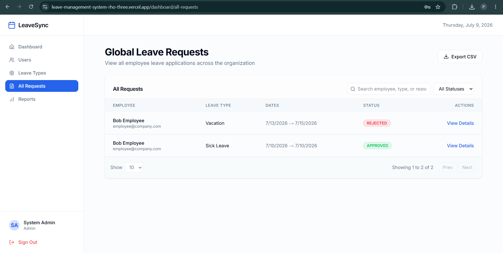

---

## Request Details

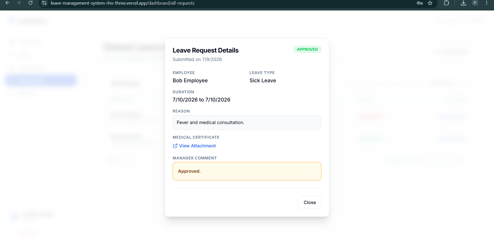

---

## Reports

### Leave Summary

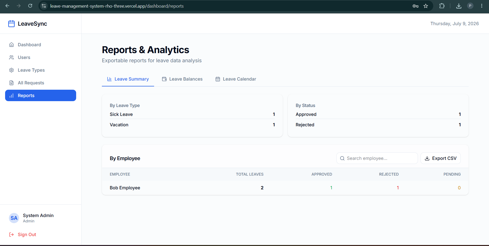

### Leave Balances

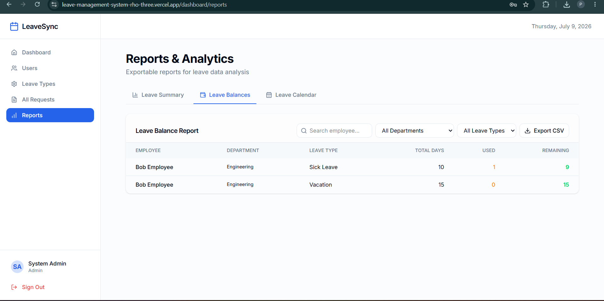

### Leave Calendar

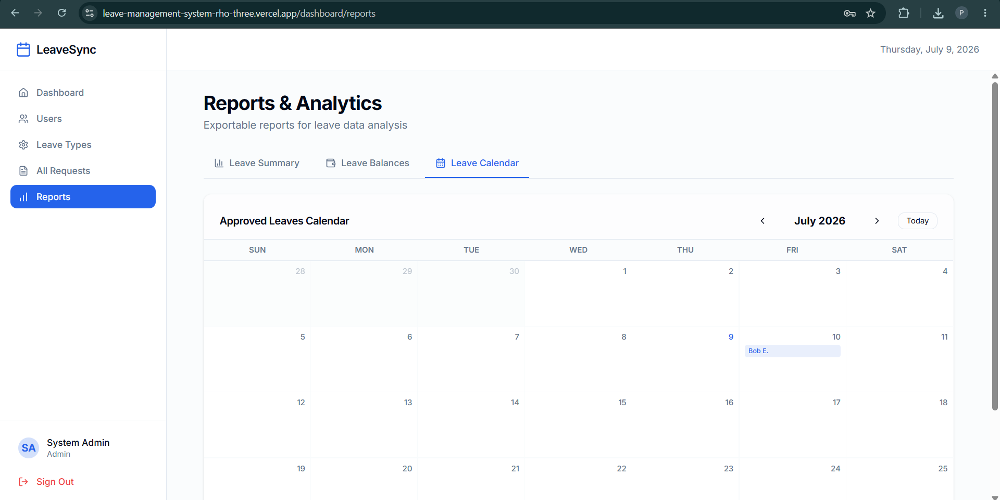

---

# API Features

Authentication

- POST /api/auth/login
- POST /api/auth/logout
- GET /api/auth/me

Users

- CRUD Users

Leave Types

- CRUD Leave Types

Leave Requests

- Apply Leave
- Cancel Leave Request
- Approve Leave
- Reject Leave
- Leave History

Notifications

- GET /api/notifications
- PUT /api/notifications/:id/read
- PUT /api/notifications/read-all
*Note: The current notification system is implemented as an in-memory service for assessment purposes to avoid modifying the production database schema. Notifications will be lost if the server restarts. In a production environment, this should be migrated to a persistent database model.*

Reports

- Summary
- Calendar
- Leave Balance
- CSV Export

---

# Security

- JWT Authentication
- Password Hashing (bcrypt)
- Role Based Authorization
- Input Validation (Zod)
- Protected API Routes
- Prisma ORM

---

# Deployment

Frontend

Vercel

Backend

Render

Database

Neon PostgreSQL

---

# Future Improvements

- Email Notifications
- Multi-Level Approval
- Public Holidays
- Attendance Integration
- Mobile Responsive Improvements
- Docker Support
- CI/CD Pipeline

---

# Author

**Phaneendra Kanduri**

LinkedIn

https://www.linkedin.com/in/phaneendra-kanduri/

GitHub

https://github.com/Phaneendra2005

---

## License

MIT License